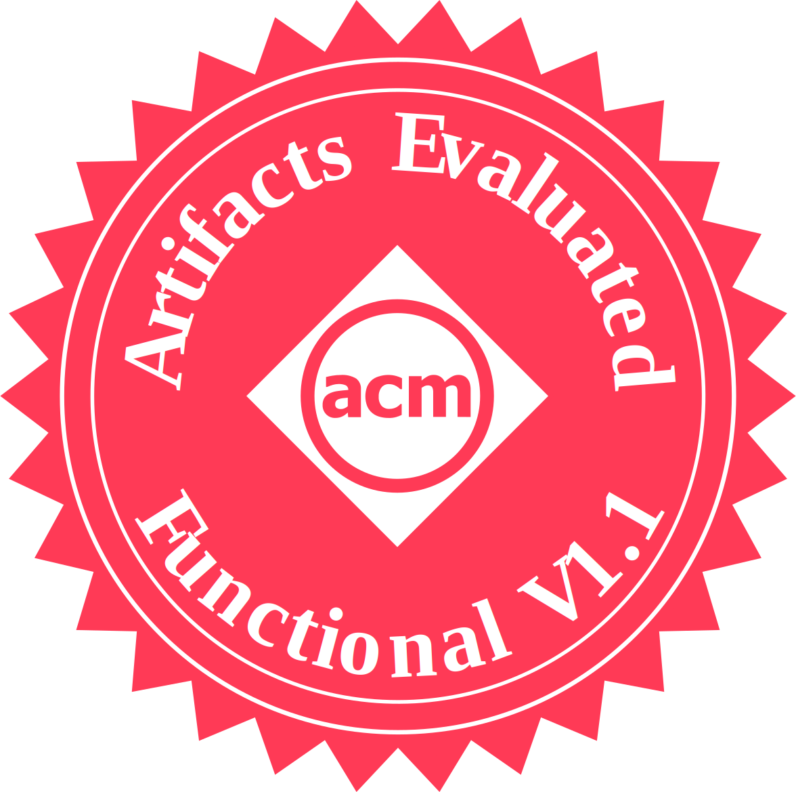
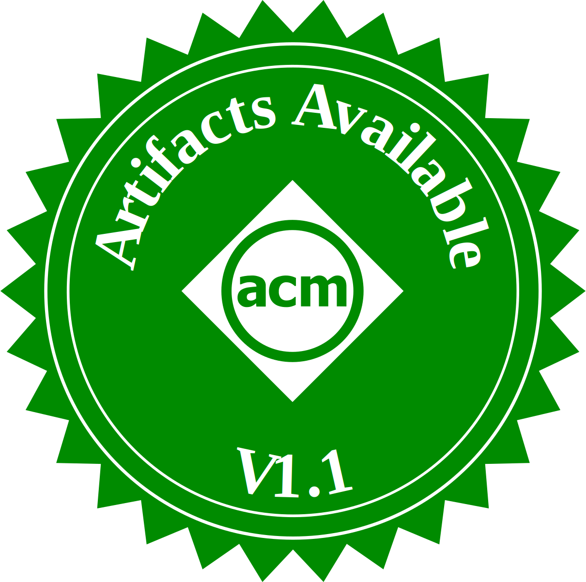
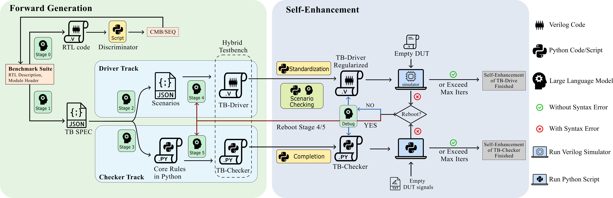

# AutoBench 1.0

  



This is the code implementation of paper [*AutoBench: Automatic Testbench Generation and Evaluation Using LLMs for HDL Design*](https://dl.acm.org/doi/10.1145/3670474.3685956), which has been **accepted** by [*6th ACM/IEEE International Symposium on Machine Learning for CAD*](https://mlcad.org/symposium/). 

- Updated on 15.Aug.2024: This open source work is honored to be **nominated** for the **Best Artifact Award** 😃. One reviewer successfully reproduced our work and achieved **even better** results than reported in the paper.

- Updated on 2.Sep.2024: two demos are added into [saves/test](saves/test). By checking it, you can better understand the whole process of AutoBench without running it by your self.

- Updated on 9.Sep.2024: Our work is finally awareded with the **Best Artifact award** during MLCAD 2024😃😃.

This open-sourced project contains the `code implementation` of *AutoBench*, the `dataset` (see json files in [`data/HDLBits`](data/HDLBits), the dataset is extended from HDLBits data) and the `experimental results` (see the following google drive link) referred in paper Section V Experimental results. Due to the large size, the experimental results are uploaded to [google drive](https://drive.google.com/drive/folders/1EhG9Ch4vDzMtOsDvoiHthU0OWsZP1xRh?usp=sharing).




## Authors

 - [Ruidi **Qiu**](https://www.ce.cit.tum.de/eda/personen/ruidi-qiu/), Technical University of Munich, r.qiu@tum.de 
 - [Grace Li **Zhang**](https://www.etit.tu-darmstadt.de/fachbereich/professuren_etit/etit_prof_details_121280.en.jsp), TU Darmstadt, grace.zhang@tu-darmstadt.de
 - [Rolf **Drechsler**](https://www.rolfdrechsler.de/), University of Bremen, drechsler@uni-bremen.de
 - [Ulf **Schlichtmann**](https://www.ce.cit.tum.de/eda/personen/ulf-schlichtmann/), Technical University of Munich, ulf.schlichtmann@tum.de
 - [Bing **Li**](https://www.eti.uni-siegen.de/dis/mitarbeiter), University of Siegen, bing.li@uni-siegen.de

## What is AutoBench
AutoBench is the first **LLM-based testbench generator** for digital circuit design, which requires only the description of the design under test (DUT) to automatically generate comprehensive testbenches. In AutoBench, a hybrid testbench structure and a self-checking system are realized using LLMs. To validate the generated testbenches, we also introduce an automated testbench evaluation framework (Eval0, Eval1, Eval2, Eval2b) to evaluate the quality of generated testbenches from multiple perspectives.

## Setup

### Software

- Python 3.8 or newer.

- The latest version of Icarus Verilog (totally supports ***IEEE Std 1800-2012***). (don't fogget to modify the bin path of iverilog in [iverilog_call.py](iverilog_call.py))

(We strongly recommend utilizing the latest versions of Python and Icarus Verilog. This is due to the fact that higher version expressions employed by LLMs may result in compatibility issues or bugs when executed in older software versions.)

### Python requirements

see [requirements.txt](requirements.txt):

- anthropic==0.31.2
- matplotlib==3.9.1
- openai==1.35.15
- PyYAML==6.0.1
- Requests==2.32.3
- tiktoken==0.7.0

### LLM API keys

You must insert your OpenAI/Anthropic API key into [`config/key_API.json`](config/key_API.json) before running the project.

### IVerilog Path

You must change `IVERILOG_PATH` and `IVERILOG_VVP_PATH` in [`iverilog_call`](iverilog_call.py) according to the installation path of iverilog on your device.

### Other Notes

If your CPU is heavily occupied or very inefficient, consider enlarging the value for `timeout` in your config file, otherwise simulation may fail due to too much time spent on simulation and the final performance may decrease.

## Running

This project's config is stored in YAML files under [`/config`](config). You have multiple options to run this project.

### Run by preset configs

We provided 4 demos for a quick start, you can access them via args:

- single task demo for CMB circuits: `python main.py -d cmb`
- single task demo for SEQ circuits: `python main.py -d seq`
- full task demo for all circuits: `python main.py -d 156`
- full task demo for all circuits using baseline (directgen): `python main.py -d baseline`

We already run two demos in [saves/test](saves/test).

### Run by customized configures

You can change the config file in [`config/custom.yaml`](config/custom.yaml) to customized your running. Here are explanations for some settings:

- `-save-pub-prefix/subdir/dir`: the saving path of log and results. The saving path will be `dir` + `subdir` + `prefix`.

- `-gpt-model`: the LLM model called in work. Now it perfectly supports [OpenAI's conversational LLM models](https://platform.openai.com/docs/models) such as gpt3.5, gpt4, gpt3.5turbo, gpt4turbo, gpt4o. Please use the official model name such as *gpt-4-turbo-2024-04-09* in this option. It also imperfectly support [Claude3 models](https://docs.anthropic.com/en/docs/about-claude/models). But we do not guarantee that the Claude3 model will function flawlessly in our work.
  
- `-autoline-probset-only`: this is a list letting the program only run certain tasks. For instance, if I only want to run two tasks: *mux2to1v* and *m2014_q4b*, I should write ['mux2to1v', 'm2014_q4b'] here.
  
- `-autoline-timeout`: Verilog or Python codes that runs longer than this value will be considered as failed because LLM-generated codes may have a finite loop. If your computer is old or heavily occupied, enlarge this value. If too small, some correct codes may be distinguished as failed; if too large, the generated signal file in the infinite loop may be too large to stop your computer.
  
- `-autoline-promptscript`: if you want to run AutoBench, then `pychecker`; If you want to run baseline, then `directgen`.

- `autoline-save_compile`: default - True; If you do not want the compilation files of Eval2 (more than 100 files per task), set this configuration to False.

For other configuration items, please see [default.yaml](config/default.yaml). I would not recommend modifying other configuration items unless you possess sufficient understanding of these components.

## Other Notes

- This version of AutoBench is the first public version after paper acceptation.

- The circuit_type file in data/HDLBits is only for reference but not used in our work. In AutoBench workflow, the circuit type of each task is discriminated in Stage 0.

- During its development phase, Autobench was also referred to by the project names "TaistBench" and "ChatBench". That is why you will see the file name ChatbenchRunInfo.

## License

This project is licensed under the GNU General Public License (GPL), a free software license that aims to protect user freedoms. Under the GPL, you are free to use, modify, and distribute this software, but you must share any modifications under the same license.

## Reference

```
@inproceedings{10.1145/3670474.3685956,
author = {Qiu, Ruidi and Zhang, Grace Li and Drechsler, Rolf and Schlichtmann, Ulf and Li, Bing},
title = {{AutoBench: Automatic Testbench Generation and Evaluation Using LLMs for HDL Design}},
year = {2024},
isbn = {9798400706998},
publisher = {Association for Computing Machinery},
address = {New York, NY, USA},
url = {https://doi.org/10.1145/3670474.3685956},
doi = {10.1145/3670474.3685956},
booktitle = {Proceedings of the 2024 ACM/IEEE International Symposium on Machine Learning for CAD},
articleno = {18},
numpages = {10},
keywords = {Hardware Simulation, Large Language Model, Testbench Generation},
location = {Salt Lake City, UT, USA},
series = {MLCAD '24}
}
```
